# Power Grid Custom Version: Vision Document

---

## Introduction

This document is for an extended version of Power Grid, designed for 10 players with computer-assisted management. Will add support for automated resource management, player order tracking, using physical remote controllers and RFID cards.

---

## Game Equipment

- **10 Remote Controls (433 MHz)**: Each player has a remote control with 4 buttons (A, B, C, D).
- **2 RFID Readers (Smart RFID Card Reader 13.56 MHz)**: These readers work as keyboard inputs and read only the UID from the tags.
- **150 Ntag215 RFID Stickers (13.56 MHz)**: All power plant, event, and special cards are tagged with RFID stickers for identification by the system.
- **433 MHz Superheterodyne RF Receiver Module**: Used to receive signals from the remote controllers.
- **433 MHz RF Transmitter Module**: Used for programming the controllers.
- **Raspberry Pi 4 (2GB RAM)**: Used to collect information and manage the game, primarily for its USB support to connect the RFID card readers.
- **Windows computer**: The main user interface will run on a computer with Windows OS.

---

## Game Phases and Rules

---

### Overview of Phases

The game consists of the following phases, each enhanced with automated player management and real-time tracking:

1. **Phase 1: Auction Power Plants**
2. **Phase 2: Buy Resources**
3. **Phase 3: Build Cities**

A chess-style timer is implemented for all phases. Will be configurable.

---

### Phase 1: Auction Power Plants

- The system tracks the player order. For the first round, players establish their order by pressing **button A** on their remote control in the desired order. **Button D** can be used for corrections if a mistake is made.

- The clock for the first player in the designated order starts after everybody pressed the A button (I'm ready). The first player will choose a power plant to auction. During choosing, the clock of the player that is in order will work. The power plant card, tagged with an RFID sticker, is placed on **RFID Reader 1**, and this triggers the clocks for all active players.

- Players must indicate their participation by pressing **button A** (participate) or **button B** (pass) on their controllers. Once all active players have made a choice, their clocks will resume as they decide on their bid amount (blind bid). Pressing **button A** signifies readiness to submit a bid. Players can withdraw by pressing **button B** until they have made a bid.

- In case multiple players bid the max amount, pressing **button A** signifies participation in the next bidding round. **Button B** means the player lost the bid.

- The auction proceeds until only one player remains, who presses **button A** to indicate they have won, while the others press **button B**. The winner must then either keep or discard a power plant:
  - If they choose to discard, they place the power plant on **RFID Reader 2** for removal from their inventory.
- The auction continues with the next player (in order) that selects a new power plant or passes by pressing **button B** (note: during the first round, all players must buy a power plant).

- **Special Card Auction**: At any time during the auction phase (except the first round), players may press **button C** to initiate a special card auction. This can occur during or after a power plant auction. When a special card auction is initiated, the player’s clock starts, and they place the special card on **RFID Reader 1**.

- The special card auction follows the same rules as the power plant auction.

---

### Phase 2: Buy Resources

- Resources are bought in reverse player order. Players purchase resources in the following order: coal, oil, garbage, and uranium.

- Players use their controllers as follows:
  - **Button A**: Increase the quantity of the selected resource.
  - **Button B**: Decrease the quantity.
  - **Button C**: Confirm purchase and proceed to the next resource.
  - **Button D**: Go back to adjust previous selections.

- Once all resources are bought, the player presses **button A** to conclude their turn. Players can go back and adjust their choices before pressing **button A** to finalize. After finalizing the uranium purchase, the turn ends automatically.

---

### Phase 3: Build Cities

- Players build cities using a similar system:
  - **Button A**: Add a house.
  - **Button B**: Remove a house.
  - **Button C**: Confirm and trigger the next player’s turn.

---

### Phase 4: Bureaucracy (Resource Management and Market Updates)

- During the bureaucracy phase, power plants with **limited actions** (e.g., green plus or red plus) can be discarded by placing them on **RFID Reader 2**. This removes the power plant from the player’s inventory.

- Player order is recalculated based on the number of houses and power plants owned. The timing of this recalculation is configurable: it may occur at the end of the bureaucracy phase or after the auction phase, depending on game preferences. This configuration can be specified in the settings file.

- The market is updated based on resources used, and adjustments are made based on event cards or special game conditions.

---

## Custom Elements

---

### Event Cards

- **Event Cards** are drawn randomly from the same stack as power plants and introduce dynamic changes to the game.
- These events affect resource availability, power plant efficiency, or market conditions (e.g., "No Wind", "-3 for a specific resource", "+3 for the most expensive resource").

### Special Cards

- Players can trigger the auction of special cards (e.g., battery, power generator, deposit, devil’s eye, bureaucrat, coal generator, oil generator) at any time during the power plant auction phase by pressing **button C** on their controller.

---

## System Automation and Controls

---

### Player Controllers (433 MHz)

- Each player has a remote controller with **4 buttons** (A, B, C, D). These buttons are used for:
  - **Button A**: Start turn, participate, bid, increase resource/house count, conclude turn, etc.
  - **Button B**: Pass, withdraw from auction, decrease resource/house count, or indicate not discarding power plants.
  - **Button C**: Initiate a special card auction or confirm purchases and actions.
  - **Button D**: Go back or correct mistakes.

### Timer Configuration

- A chess-style timer is used for each player during different phases. The time settings are configurable based on the game round or phase. Additional time can be added at the end of each phase, depending on game preferences.

### Resource Management

- The system manages the market and resource availability automatically once it receives updates from the players about auctions or special card purchases.
- **Manual adjustments** are possible to correct any mistakes via an admin interface.

### RFID Cards

- RFID stickers are used on all cards. An RFID reader reads what power plant/special card is auctioned.

### Data Management

- **JSON Format**: All data for power plants, configuration settings, and resources will be stored in JSON format. This allows for easy modification, portability, and integration with the Raspberry Pi system.

### System Architecture

- The main user interface will run on a **Windows** computer. This UI will manage the game flow, player actions, and system configurations.
- The system will be designed with **separate services** that communicate via **TCP/IP**. 

---

## Power Grid Custom Version: User Interface Design

---

### Overview

### UI Layout

The interface will be divided into distinct panels, each serving a specific function within the game:

#### 1. Players Panel (Player Timers)
- **Purpose**: To display the status of each player, including active timers for the current game phase.
- **Design**: 
  
  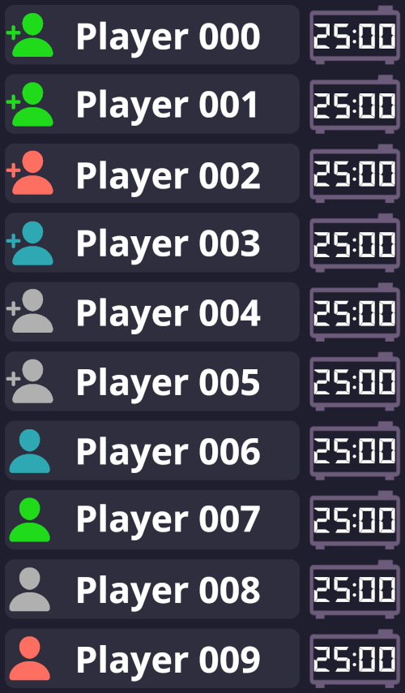

#### 2. Market Panel
- **Purpose**: To provide a view of resource availability, prices, and any adjustments made during the game.
- **Design**: 
  
  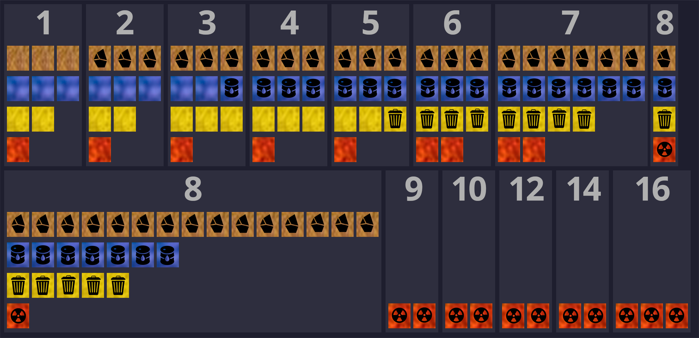

#### 3. Supply Panel
- **Purpsoe**: To show what the current supply is, based on current game phase
- **Design**:     
  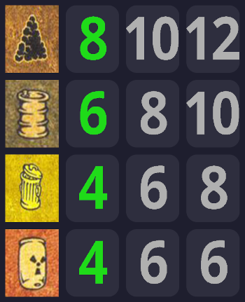

#### 4. Current Action Panel
- **Purpose**: To guide the active player through their available actions, based on the current game phase.
- **Design**: 
  - Choose Power Plant: 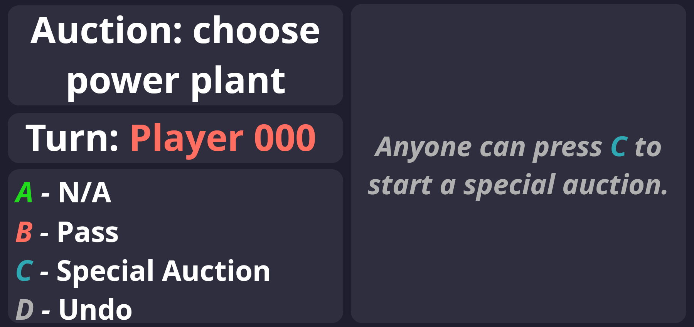
  - Bid or Pass: 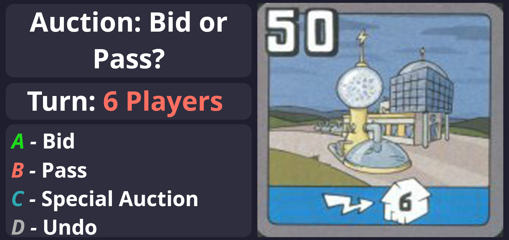
  - How much: 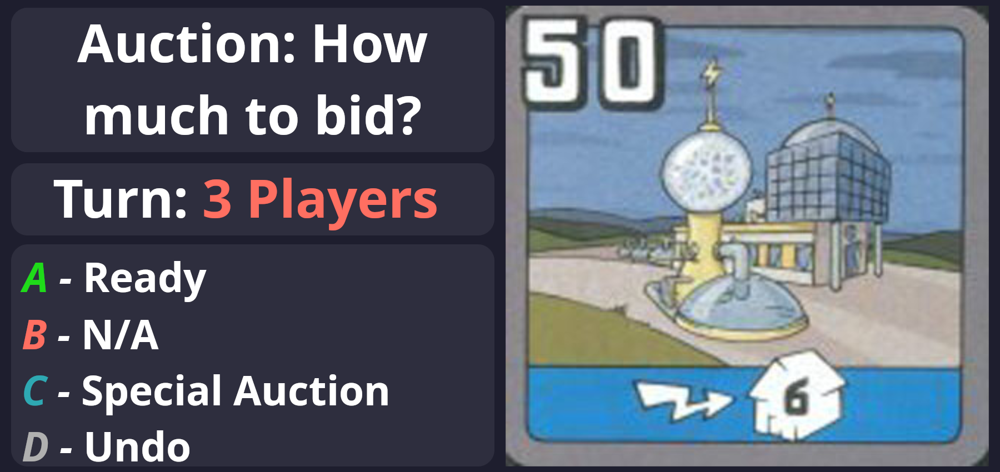
  - Did you won: 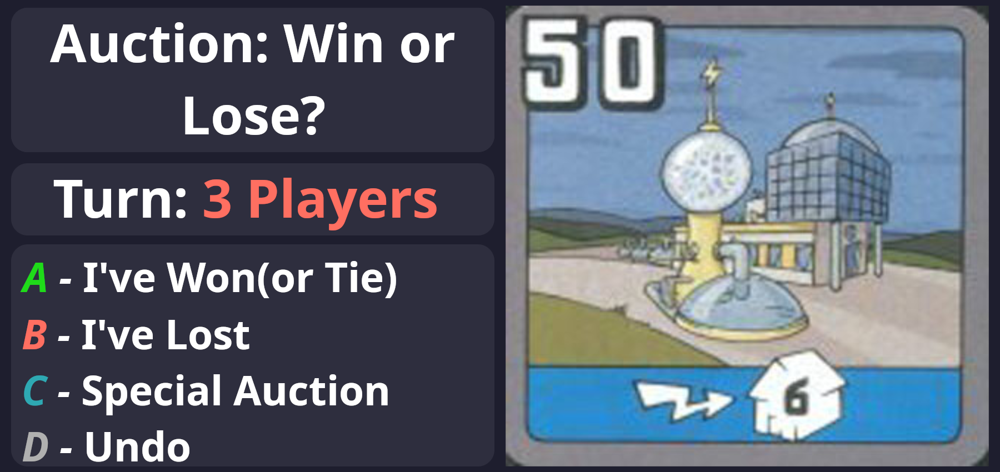
  - Throw any card: 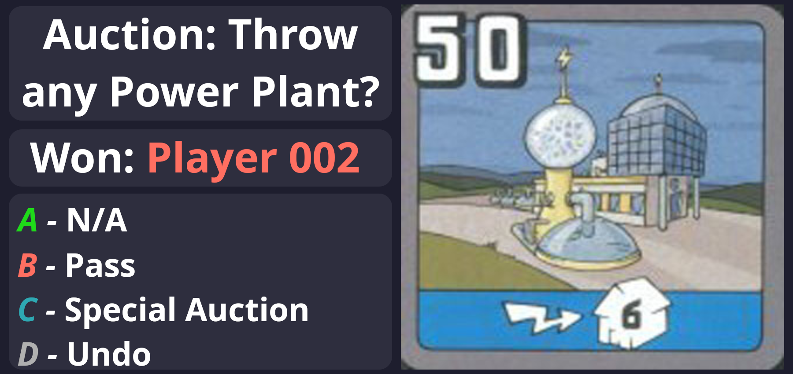
  - Buy resources: 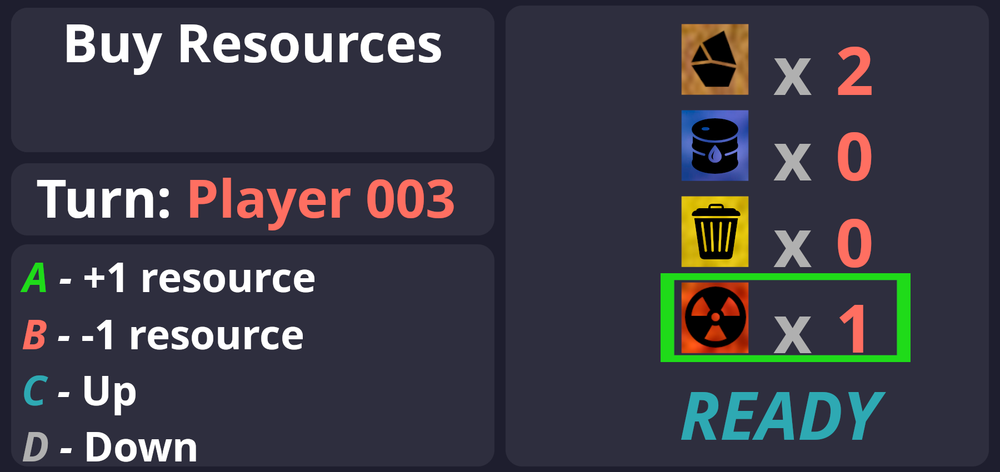
  - Build Cities: 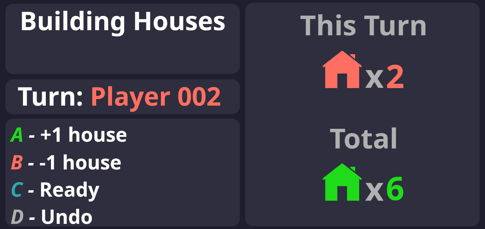
  - Bureaucracy: 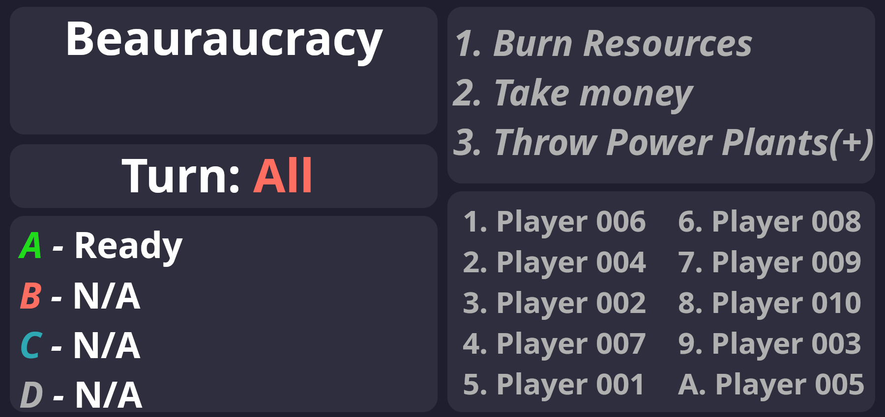

#### 4. Settings and Admin Controls
- **Purpose**: To allow game administrators to configure game settings and make manual adjustments if necessary.
- **Design**: Accessible from a dedicated button, this panel will provide controls for configuring timers, adjusting market settings, recalculating player order, or correcting errors.
- **Components**: Input fields, sliders, and buttons for manual overrides.

### User Flow

- **Phase Transition**: The UI will guide players through each phase of the game, automatically transitioning between phases based on player inputs (e.g., ending a turn with the remote controller).
- **Real-Time Updates**: All panels will be updated in real-time to reflect player actions, market changes, and game events.
- **Error Handling**: The UI will include prompts and alerts to handle common errors, such as missed inputs or invalid actions.

### Player Order and Turn Tracking

- The system calculates player order based on the number of houses, total power plant scores and automatically tracks player turns.
- Players press a button on their remote controller to indicate the end of their turn.

---

## **Color Palette Summary for GUI Design**
``` css
{
  /* Background Colors */
  --primary-bg: #1E1E2E;
  --secondary-bg: #2E2E3E;
  --border-bg: #3E2E3E;

  /* Accent Colors */
  --primary-accent: #FF6F61;
  --secondary-accent: #6C5B7B;
  --tertiary-accent: #F8B195;

  /* Text Colors */
  --primary-text: #FFFFFF;
  --secondary-text: #B0B0B0;
  --highlight-text: #FF6F61;
}
```

## **Fonts**

