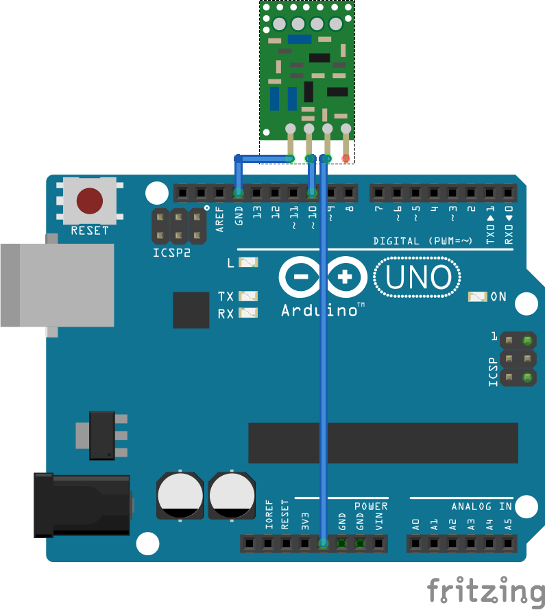

# Arduino RF Transmitter Control

## Overview
This project allows an **Arduino** to send RF signals using a **433 MHz RF transmitter** and the **RCSwitch** library. The system can dynamically transmit signals for up to **15 players**, each with **4 buttons** (A, B, C, D). Communication is controlled via **serial commands (CLI/Python/etc.)**.

## Hardware Requirements
- **Arduino** (Uno, Mega, or compatible board)
- **433 MHz RF Transmitter Module**
- **RCSwitch Library** (for RF communication)
- **Serial Communication Interface** (USB connection to a computer)

## Software Requirements
- **Arduino IDE** (for uploading the sketch)
- **RCSwitch Library**
- **Serial Terminal or Python Script** (for sending commands)

## Wiring Setup
| Arduino Pin | RF Module Pin |
|------------|--------------|
| **10**     | **DATA** |
| **VCC**    | **5V** |
| **GND**    | **GND** |



## Protocol Specification
Each RF signal is an **8-bit encoded message**, formatted as:

```
PPPP BBBB
(PlayerID + ButtonID)
```

| Field      | Bits | Description |
|------------|------|-------------|
| **Player ID** | 4 | 1-15 (`0001` to `1111`) |
| **Button**   | 4 | `0001` (A), `0010` (B), `0100` (C), `1000` (D) |

### **Example Encodings**
| Command | Player ID | Button | Encoded Binary | Encoded Decimal |
|---------|----------|--------|---------------|----------------|
| `send(1,A)` | 1 | A (`0001`) | `0001 0001`  | `17` |
| `send(5,B)` | 5 | B (`0010`) | `0101 0010`  | `82` |
| `send(12,D)` | 12 | D (`1000`) | `1100 1000`  | `200` |

## How to Use

### **1. Upload the Sketch to Arduino**
- Open `arduino_rf_transmitter.ino` in the Arduino IDE.
- Select the correct **board** and **port**.
- Click **Upload**.

### **2. Send Commands via CLI**
Using a serial terminal (Linux/macOS):
```bash
screen /dev/ttyUSB0 9600
```
Then type:
```
send(3,A)
```
On Windows, use **PuTTY** or **Arduino Serial Monitor** (set baud to **9600**).

### **3. Send Commands Using Python**
```python
import serial
arduino = serial.Serial('/dev/ttyUSB0', 9600, timeout=1)
arduino.write(b'send(3,B)\n')
```

### **4. Stop Transmission**
To stop transmission at any time, send:
```bash
echo "stop()" > /dev/ttyUSB0
```

## Notes
- Ensure the **433 MHz transmitter** is connected correctly.
- If signals are weak, add a **wire antenna (17 cm)** to the transmitter.
- Modify the Arduino sketch if more customizations are needed.


